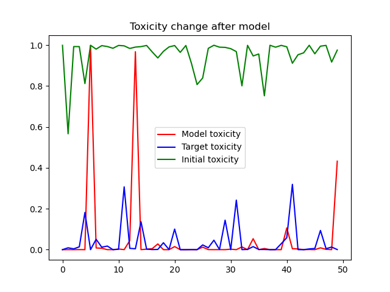

# Final Solution Report

This repository does not bring any new ideas to the table.

Main results of this research are:

- Exploration of the text detoxification field
- Implementation of the convenient scripts for GeDi model
- Implementation of the convenient scripts for RoBERTa based toxicity classifier
- Research on the text detoxification problem using NLP models

Also I plot some visualizations and provide the code for them. Here is one of them:

It shows how the GeDi model changes the toxicity of random 50 sentences.

**Conclusion**: as for me, I think that the text detoxification problem can be solved using modern **Large Language
Models**: ChatGPT, GigaChat, YandexGPT. It is just proper **Prompt Engineering**.
